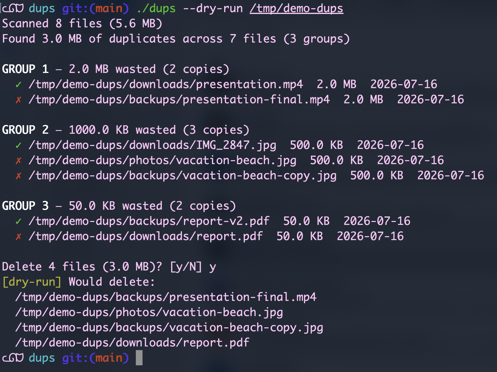

# dups

[](https://github.com/Adi-UA/dups/actions/workflows/ci.yml)

Fast duplicate file finder. Scans a directory tree, identifies files with
identical content, shows wasted space, and lets you delete the copies.

<p align="center">
  
</p>

## Install

```bash
go install github.com/Adi-UA/dups@latest
```

## Features

- Single binary, zero dependencies, cross-platform (macOS, Linux, Windows)
- Concurrent hashing with a worker pool (goroutines sized to CPU count)
- Smart two-pass strategy: size filter eliminates 70-90% of files without
  reading content, then partial hash (first 4 KB) before full SHA-256
- Interactive mode with color output and delete confirmation
- JSON mode for scripting (`--json`)
- Memory bounded: streams files through the hasher, never loads full content

## Usage

```bash
# Scan current directory
dups .

# Minimum file size filter
dups ~/Photos --min-size 1mb

# JSON output for scripting
dups . --json | jq '.groups[].wasted_bytes'

# Dry run (show what would be deleted)
dups . --dry-run

# Summary only (no file list)
dups . --summary

# Exclude patterns
dups . --exclude "node_modules" --exclude ".git"
```

## How It Works

1. Walk the directory tree, group files by size
2. Discard files with unique sizes (can't be duplicates)
3. For remaining files >1 MB, hash only the first 4 KB (partial hash)
4. Discard files with unique partial hashes
5. Full SHA-256 hash of remaining candidates (concurrent worker pool)
6. Group by identical hash, report, offer deletion

See [DESIGN.md](DESIGN.md) for architecture details.

## License

MIT
